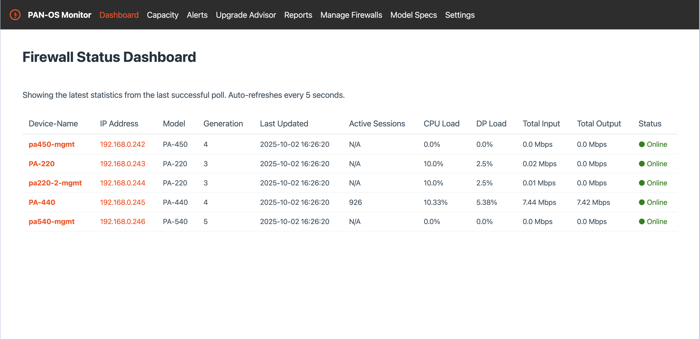

# PAN-OS Stats Monitor

A web-based monitoring dashboard for Palo Alto Networks firewalls. This tool polls devices for performance and capacity metrics, stores the data in a local SQLite database, and provides a web interface to view historical graphs, analyze capacity, and export professional reports.

  
*Note: The UI has been significantly updated. This screenshot should be updated to reflect the new look.*

---
## Features ✨

*   **Modern UI:** A clean, responsive interface with a branded theme and a **dark mode** toggle.
*   **Status Dashboard:** A centralized view of all monitored firewalls with a live **search/filter bar** and a **manual refresh** button.
*   **Capacity Dashboard:** Provides an at-a-glance view of current object usage (rules, routes, tunnels, etc.) against the device's maximum capacity, with styled **progress bars** for clear visual feedback.
*   **Configurable Alerting:** A dedicated "Alerts" page highlights any capacity metric that exceeds a user-configurable threshold. Features bulk-acknowledgment of alerts.
*   **Historical Graphing:** Click on any firewall to view detailed historical graphs for key performance metrics, including a new chart for **SSL Decrypt Sessions**.
*   **Flexible Timeframes:** View graphs and summary data for various timeframes (5 mins to 30 days) or select a custom date range.
*   **Advanced Upgrade Advisor:** Analyzes peak usage and recommends an upgrade path to both the next model in the **same generation** and a comparable model in the **next generation**.
*   **Professional PDF Reporting:**
    *   Asynchronous report generation with a status page—the UI never freezes.
    *   Branded reports featuring the Palo Alto Networks logo, a professional title page, and a clickable **Table of Contents**.
    *   Multiple report types: Capacity, Table Only, Graphs Only, or a Combined report.
*   **Detailed Device Discovery:**
    *   Automatically polls and displays a comprehensive list of over 35 detailed capacity limits (max sessions, max rules, etc.) for each firewall.
    *   Intelligently uses the correct API commands based on whether a firewall has the advanced routing engine enabled.
* **Intelligent Discovery & Polling:**
    * Automatically discovers and saves the **hostname**, **model**, and **PAN-OS version** for newly added firewalls.
    * Asynchronous background jobs for all long-running tasks (data refresh, Panorama import, report generation) with a global status indicator in the navigation bar.
*   **Database Management:**
    *   **Backup & Restore:** Easily create on-demand database backups and upload backups for restoration directly from the UI.
    *   **Automatic Pruning:** Automatically deletes historical statistics older than a configurable number of days (default is 90) to keep the database lean.
* **Panorama Integration:** Import all connected firewalls directly from your Panorama instance with a single click.
* **Model Specifications Management:** A full CRUD interface to add, view, **modify**, and **bulk-delete** hardware specifications for different firewall models.
* **Multi-Firewall Support:** Monitor dozens of firewalls. Firewalls can be added individually or bulk-imported from a text file.
* **Persistent Storage:** Uses a local SQLite database (`monitoring.db`) to store all configuration and historical statistics.
* **Background Polling:** A multi-process background worker continuously polls devices without blocking the web interface.

---
## Installation & Setup

Follow these steps to get the PAN-OS Stats Monitor running.

### 1. Prerequisites

Before you begin, you must have an administrator account on your devices with API access enabled.

* On your **firewalls**, navigate to **Device > Admin Roles**. Select a role, and in the **XML API** tab, ensure that **Report**, **Operational Requests**, and **Show** (under XML API) are checked. Assign this role to the user account you will use for polling.
* If using the Panorama import feature, the same API access must be enabled for your **Panorama** user account.

### 2. Clone the Repository

Clone the repository to your local machine:
```
git clone https://github.com/PaloAltoNetworks/panos-monitor
cd panos-monitor
```
### 3. Create a Python Virtual Environment

It's highly recommended to use a virtual environment to manage project dependencies.

* **Create the environment:**
    ```
    python3 -m venv pan-monitor-app
    ```
* **Activate the environment:**
    * On macOS or Linux:    

        ```
        source pan-monitor-app/bin/activate
        ```
    * On Windows:

        ```
        panos-monitor\Scripts\activate
        ```
### 4. Install Dependencies

Install the required Python libraries from the `requirements.txt` file.
```
pip install -r requirements.txt
```
### 5. (Optional) Configure Default Firewalls

You can pre-populate the application with a default list of firewalls. This is useful for new deployments.
1. Open `app.py` in a text editor.
2. Find the `DEFAULT_FIREWALLS` list inside the `seed_initial_firewalls` function.
3. Add the IP addresses of your standard firewalls to this list.
### 6. (Optional) Add a Favicon

To add a custom icon to your browser tabs:
1. Create a `static` folder in your main project directory.
2. Place an icon file named `favicon.ico` inside the `static` folder.

## Usage Guide 🚀

### (Optional) Running as a Service on Ubuntu Linux

To ensure the application runs continuously in the background and starts automatically on boot, you can configure it as a `systemd` service. These instructions assume you have cloned the project into `/opt/pan-monitor-app`.

1.  **Create the service file:**
    ```
    sudo nano /etc/systemd/system/pan-monitor.service
    ```

2.  **Paste the following content** into the file. Be sure to replace `your_user` and `your_group` with the actual user and group you want the service to run as (e.g., `ubuntu`, `www-data`).

    ```ini
    [Unit]
    Description=PAN-OS Stats Monitor
    After=network.target

    [Service]
    User=your_user
    Group=your_group
    WorkingDirectory=/opt/pan-monitor-app
    ExecStart=/opt/pan-monitor-app/pan-monitor-app/bin/python3 /opt/pan-monitor-app/app.py
    Restart=always

    [Install]
    WantedBy=multi-user.target
    ```

3.  **Reload, Enable, and Start the Service:**
    ```
    sudo systemctl daemon-reload
    sudo systemctl enable pan-monitor.service
    sudo systemctl start pan-monitor.service
    ```

4.  **Check the Status:** You can check if the service is running correctly with:
    ```
    sudo systemctl status pan-monitor.service
    ```

5.  **View Logs:** To see the application's console output (including any errors), you can view the service logs:
    ```
    sudo journalctl -u pan-monitor.service -f
    ```

### 1. Run the Application

Launch the Flask web server by running `app.py`:
```
python3 app.py
```
On the first run, the application will automatically create a `monitoring.db` database file and a `secret.key` encryption key file in the project directory.

### 2. Initial Configuration

1.  Open your web browser and navigate to `http://127.0.0.1:4000`.
2.  Navigate to the **Settings** page using the link in the navigation bar. The application runs on port **4000** by default, so the URL will be `http://<your-server-ip>:4000`.
3.  Fill in the **Firewall Polling Settings**. These are the API credentials the poller will use to connect to individual firewalls.
4.  Fill in the **Panorama Import Settings**. These are the credentials for your Panorama instance, used only for importing devices.
5.  Set the **Polling Interval** and click **Save Settings**.

The background worker will automatically pick up these settings and begin polling.

### 3. Adding Firewalls

Navigate to the **Manage Firewalls** page. You have three options:
1.  **Import from Panorama:** Click the button to automatically discover and import all connected firewalls from your configured Panorama instance. Duplicates will be ignored.
2.  **Add Single Firewall:** Enter an IP address manually.
3.  **Import from File:** Upload a `.txt` file with one IP address per line.

### 4. Managing Model Specifications

Navigate to the **Model Specs** page. Here you can add new firewall models or delete existing ones. This data is used by the Upgrade Advisor. On first run, the application will automatically import a default list of models.

The background poller will automatically detect the model of newly added firewalls on its next cycle.

### 5. Viewing Data and Graphs

* The **Dashboard** shows the latest statistics for all devices.
* Click on any firewall's **IP address** to navigate to its detail page. Here you can view a summary table of peak statistics, see historical graphs, and use the timeframe selector to switch between views.

### 6. Using the Upgrade Advisor

* Navigate to the **Upgrade Advisor** page from the main menu.
* Select an analysis timeframe (e.g., Last 30 Days) and click 'Analyze'.
* The page will display a table showing the peak usage for each firewall compared to its model's capacity and provide a recommendation (e.g., 'Sized Appropriately' or 'Upgrade Recommended').

### 7. Exporting Data

* **CSV:** On any firewall's detail page, export the summary table to a CSV file by clicking the **'Export Table to CSV'** button.
* **PDF:** Navigate to the **Reports** page. Here you can generate new reports (Capacity, Table Only, Graphs Only, Combined) across multiple timeframes. Reports are generated in the background and will appear in the "Available Reports" list when ready to download.

---
## How It Works

* **Front-End:** A **Flask** web application serves the HTML pages.
* **Back-End:** A **background thread** runs a continuous polling loop, which uses a **multiprocessing pool** to poll devices concurrently. Long-running tasks like report generation and Panorama imports are also handled in background threads to keep the UI responsive.
* **Data Storage:** A single-file **SQLite** database (`monitoring.db`) stores all application data.
* **Configuration:** Application settings, including encrypted API credentials and hardware specifications for the Upgrade Advisor, are stored in the database.
* **Security:** The password encryption key is stored in the `secret.key` file. **Important:** Do not commit this file to version control. If you back up the database, back up this key file as well.
* **PDF Generation:** PDF reports are generated entirely on the server using **Matplotlib** to create chart images and **FPDF2** to assemble the document.

---
## PAN-OS API Commands Used

The application interacts with your Palo Alto Networks firewalls using the XML API. Here are the specific commands and their purposes:

1.  **API Key Generation (Authentication)**
    *   **API Type:** `type=keygen`
    *   **Parameters:** `user=<username>`, `password=<password>`
    *   **Purpose:** To obtain an API key for subsequent API calls.
    *   **CLI Equivalent:** (No direct CLI equivalent, this is an API-specific function)

2.  **System Information (Model, Hostname, PAN-OS Version)**
    *   **API Command:** `<show><system><info/></system></show>`
    *   **Purpose:** To discover the firewall's model, hostname, and software version.
    *   **CLI Equivalent:** `show system info`

3.  **Detailed Capacity Specifications**
    *   **API Command:** `<show><system><state><filter>cfg.general.*</filter></state></system></show>`
    *   **Purpose:** To retrieve a comprehensive list of internal configuration limits and capacities (e.g., max rules, max zones, max BFD sessions, etc.) for the specific firewall model.
    *   **CLI Equivalent:** `show system state filter cfg.general.*`

4.  **Current Configuration Object Counts (Capacity Dashboard)**
    *   **API Type:** `type=config`, `action=get`
    *   **Purpose:** To count the number of configured objects. The application counts the `<entry>` tags in the XML response.
    *   **Commands:**
        *   **Security Rules:** `xpath=/config/devices/entry[@name='localhost.localdomain']/vsys/entry/rulebase/security/rules`
        *   **NAT Rules:** `xpath=/config/devices/entry[@name='localhost.localdomain']/vsys/entry/rulebase/nat/rules`
        *   **Address Objects:** `xpath=/config/devices/entry[@name='localhost.localdomain']/vsys/entry/address`
        *   **Service Objects:** `xpath=/config/devices/entry[@name='localhost.localdomain']/vsys/entry/service`
        *   **IPsec Tunnels:** `xpath=/config/devices/entry[@name='localhost.localdomain']/network/tunnel/ipsec`

5.  **Current Operational Object Counts (Capacity Dashboard)**
    *   **API Type:** `type=op`
    *   **Purpose:** To count the number of currently active or learned operational states.
    *   **Commands:**
        *   **Routes (Standard/Advanced):** `<show><routing><route></route></routing></show>` or `<show><advanced-routing><route></route></advanced-routing></show>`
        *   **Multicast Routes (Standard/Advanced):** `<show><routing><multicast><route/></multicast></routing></show>` or `<show><advanced-routing><multicast><route></route></multicast></advanced-routing></show>`
        *   **ARP Entries:** `<show><arp><entry name='all'/></arp></show>`
        *   **BFD Sessions (Standard/Advanced, PAN-OS 11.0+):** `<show><routing><bfd><summary/></bfd></routing></show>` or `<show><advanced-routing><bfd><summary/></bfd></advanced-routing></show>`
        *   **DNS Cache Entries:** `<show><dns-proxy><cache><all/></cache></dns-proxy></show>`
        *   **Registered IPs (User-ID):** `<show><user><ip-user-mapping><all></all></ip-user-mapping></user></show>`
        *   **SSL Decrypt Sessions:** `<show><session><all><filter><ssl-decrypt>yes</ssl-decrypt><count>yes</count></filter></all></session></show>`

6.  **Real-time Performance Statistics (Main Polling Loop)**
    *   **API Type:** `type=op`
    *   **Commands:**
        *   **Active Sessions:** `<show><session><info/></session></show>`
        *   **Interface Counters:** `<show><counter><interface>all</interface></counter></show>`
        *   **Resource Monitor (CPU/DP Load):** `<show><running><resource-monitor></resource-monitor></running></show>`

7.  **Panorama Device Import**
    *   **API Type:** `type=op`
    *   **Command:** `<show><devices><connected></connected></devices></show>`
    *   **Purpose:** To retrieve a list of all firewalls connected to Panorama.
    *   **CLI Equivalent:** `show devices connected`
